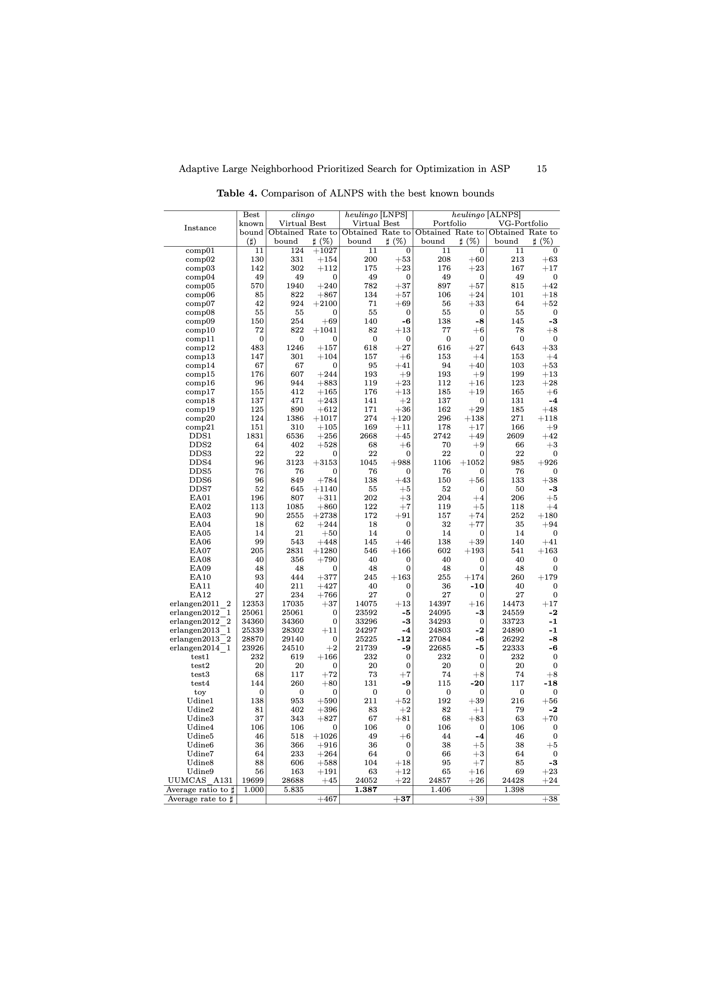

# Supplementary Materials: Adaptive Large Neighborhood Prioritized Search for Optimization in Answer Set Programming

## Comparison of ALNPS with the best known bounds of CB-CTT.



## The heulingo solver

Heulingo is an ASP-based implementation of Adaptive Large Neighborhood Prioritized Search (ALNPS)
for solving Combinatorial Optimization Problems (COPs).
ALNPS is a metaheuristic that iteratively seeks better solutions starting from an initial solution.
It alternates between performing  variability-guided destruction and
prioritized search on the current solution.

## Requirements

- python3 (version 3.10 or higher)

## Installation

| Supported back-end solvers    | Installation command         |
|-------------------------------|------------------------------|
| clingo only                   | `pip install .`              |
| clingo + clingo-dl            | `pip install ".[clingo-dl]"` |
| clingo + clingcon             | `pip install ".[clingcon]"`  |
| clingo + clingo-dl + clingcon | `pip install ".[all]"`       |

You can check a successful installation by running
```
heulingo -h
```

## Simple usage

Heulingo accepts a COP instance in ASP fact format, an ASP encoding for COP solving,
and an optional portfolio of ALNPS configurations.
Here are sample sessions for solving the traveling salesperson problem.

### clingo

```
clingo --quiet=1,0 example/tsp/tsp.lp example/tsp/instances/rand_70_300_1155482584_0.lp
```

### heulingo

```
heulingo --quiet=1,0 example/tsp/tsp.lp example/tsp/instances/rand_70_300_1155482584_0.lp
```

## The command lines used for the experiments in our LPNMR 2026 submission
---
- Curriculum-Based Course Timetabling (CB-CTT)
1. VG-random
```
heulingo --configuration=jumpy --opt-strategy=usc,11 --iter-configuration=tweety --iter-opt-strategy=bb,0 --iter-opt-heuristic=3 --iter-restart-on-model --init-cut-off-time=450 --iter-cut-off-time=6 --no-improvement-cutoff-threshold=2 --cut-off-time-increase-percent=5 --time-limit=3600 --quiet=1,0 example/cb-ctt/encoding/teaspoon.lp example/cb-ctt/instances/ITC-2007_asp/comp01.lp example/cb-ctt/instances/ud5.lp example/cb-ctt/configs/vg-random.lp
```
2. portfolio
```
heulingo --configuration=jumpy --opt-strategy=usc,11 --iter-configuration=tweety --iter-opt-strategy=bb,0 --iter-opt-heuristic=3 --iter-restart-on-model --init-cut-off-time=450 --iter-cut-off-time=6 --no-improvement-cutoff-threshold=2 --cut-off-time-increase-percent=5 --time-limit=3600 --quiet=1,0 example/cb-ctt/encoding/teaspoon.lp example/cb-ctt/instances/ITC-2007_asp/comp01.lp example/cb-ctt/instances/ud5.lp example/cb-ctt/configs/portfolio.lp
```
3. VG-portfolio
```
heulingo --configuration=jumpy --opt-strategy=usc,11 --iter-configuration=tweety --iter-opt-strategy=bb,0 --iter-opt-heuristic=3 --iter-restart-on-model --init-cut-off-time=450 --iter-cut-off-time=6 --no-improvement-cutoff-threshold=2 --cut-off-time-increase-percent=5 --time-limit=3600 --quiet=1,0 example/cb-ctt/encoding/teaspoon.lp example/cb-ctt/instances/ITC-2007_asp/comp01.lp example/cb-ctt/instances/ud5.lp example/cb-ctt/configs/vg-portfolio.lp
```

- Partner Units Problem (PUP)
```
heulingo --opt-strategy=usc,3 --configuration=trendy --iter-opt-strategy=bb --init-cut-off-time=100 --iter-cut-off-time=2 --no-improvement-cutoff-threshold=2 --cut-off-time-increase-percent=5 --time-limit=600 --quiet=1,0 example/pup/encoding.lp example/pup/configs/vg-random.lp example/pup/show.lp example/pup/instances/07-partner_units_polynomial-28-0.asp
```
- Shift Design (SD)
```
heulingo --opt-strategy=usc,3 --configuration=handy --iter-opt-mode=opt,0,dynamic --init-cut-off-time=600 --iter-cut-off-time=60 --no-improvement-cutoff-threshold=2 --cut-off-time-increase-percent=5 --time-limit=3600 --quiet=1,0 example/sd/shift_design.lp example/sd/configs/vg-random.lp example/sd/instances/4_30m.lp
```
- Social Golfer Problem (SGP)
```
heulingo --iter-opt-mode=opt,0,dynamic --init-cut-off-time=60 --iter-cut-off-time=6 --no-improvement-cutoff-threshold=2 --cut-off-time-increase-percent=5 --time-limit=1800 --quiet=1,0 example/sgp/golfer.lp example/sgp/configs/vg-random.lp example/sgp/instances/8.lp
```
- Sudoku Puzzle Generation (SPG)
```
heulingo --configuration=many -t4 --init-cut-off-time=20 --iter-cut-off-time=2 --no-improvement-cutoff-threshold=2 --cut-off-time-increase-percent=5 --time-limit=3600 --quiet=1,0 example/spg/sudoku.lp example/spg/configs/vg-random.lp example/spg/instances/9x9.lp
```
- Traveling Salesperson Problem (TSP)
```
heulingo --init-cut-off-time=10 --iter-cut-off-time=1 --no-improvement-cutoff-threshold=2 --cut-off-time-increase-percent=5 --time-limit=300 --quiet=1,0 example/tsp/tsp.lp example/tsp/configs/vg-random.lp example/tsp/instances/rand_70_300_1155482584_0.lp
```
- Weighted Strategic Companies (WSC)
```
heulingo --opt-strat=usc,15 --iter-opt-strat=bb,0 --init-cut-off-time=600 --iter-cut-off-time=12 --no-improvement-cutoff-threshold=2 --cut-off-time-increase-percent=5 --time-limit=3600 --quiet=1,0 example/wsc/wsc.lp example/wsc/configs/vg-random.lp example/wsc/instances/wstratcomp_001.lp
```

## Known issues

- When solving problems that use lexicographic optimization, running heulingo with
  ```--iter-opt-mode=opt,N,dynamic,lt``` (where ```N``` $\leq$ 0) or
  ```--iter-opt-mode=opt,M,dynamic,leq``` (where ```M``` < 0)
  may result in incorrect optimal solutions.

## References

- [Large Neighborhood Prioritized Search for Combinatorial Optimization with Answer Set Programming](https://doi.org/10.24963/kr.2024/72),
  KR 2024 (CORE2023 Rank A*),
  Irumi Sugimori, Katsumi Inoue, Hidetomo Nabeshima, Torsten Schaub, Takehide Soh, Naoyuki Tamura, Mutsunori Banbara.
  [[repository](https://github.com/banbaralab/kr2024)]

- [ASP-Based Large Neighborhood Prioritized Search for Course Timetabling](https://doi.org/10.1007/978-3-031-74209-5_5),
  LPNMR 2024 (CORE2023 Rank B),
  Irumi Sugimori, Katsumi Inoue, Hidetomo Nabeshima, Torsten Schaub, Takehide Soh, Naoyuki Tamura, Mutsunori Banbara.
  [[repository](https://github.com/banbaralab/lpnmr2024)]

